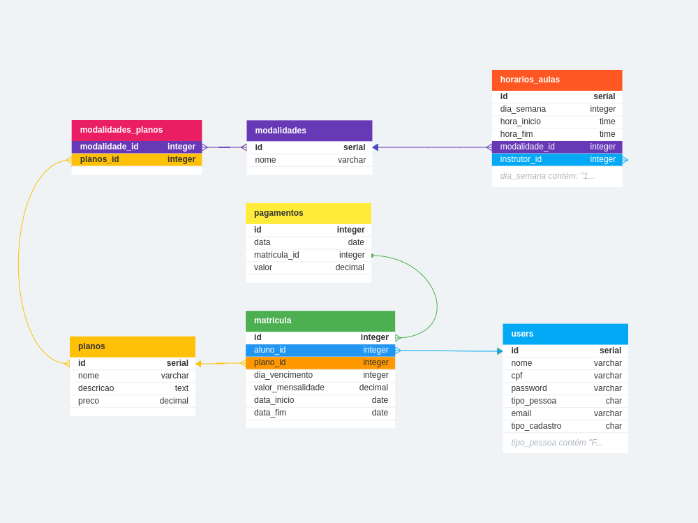

## Trabalho de conclusão

Com base no banco de dados criado para a academia SuperFit ao longo da disciplina, você deverá:

- Criar uma API contendo um CRUD (Create, Read, Update e Delete) para cada uma das tabelas. São elas: (pessoas, planos, modalidades, matriculas, horarios_aulas e modalidades_planos)

- Para acessar as rotas, será necessário o uso de token JWT

- Criar uma rota que valida se o cliente está adimplente e pode fazer o uso da academia;

- Criar um relatório gerencial que apresente o total de alunos por plano, o valor total recebido e o total inadimplente. Os filtros do relatório são: Um range de planos e um range de datas.

Dica: Analise a necessidade de criação de novas tabelas e/ou campos para adequar a base de dados e resolver os problemas propostos.

O trabalho pode ser executado em duplas e não será necessário a entrega de um front-end.

## Relacionamento das Entidades

    

## Dependências/comands

|Command | Description|
| --- | --- |
|`npm i express`|Instalar pacote express|
|`npm i -D @types/express`|Instalar Type express|
|`npm i pg`|Instalar o pacote do PG PostgreSQL|
|`npm i -D @types/pg`|TypeScript para o PG PostgreSQL|
|`npm i -D nodemon`|Nodemon para rodar o servidor|
|`npm i -D typescript`|Typescript|
|`npm i -D ts-node`|ts-node para rodar o typescript sem compilar|
|`npm i dotevn`|Doteenv para guardar chaves privadas|
|`npm i -D @types/dotenv`|TypeScript para dotenv|
|`npm i bcrypt`|criptografar a senha do usuário|
|`npm i jsonwebtoken`|Gerar token de acesso/autorização ao sistema om login|
`npm i @types/bcrypt`|Tipografia para typescript|
|`npm i @types/jsonwebtoken`|Tipografia para typescript|